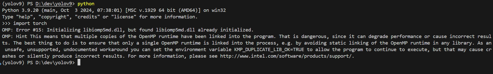

# YOLOv9

## Install

```[bash]
conda create -n yolov9 python=3.9
conda activate yolov9
conda install pytorch torchvision torchaudio pytorch-cuda=11.8 -c pytorch -c nvidia
pip install -r requirements.txt
wget https://github.com/WongKinYiu/yolov9/releases/download/v0.1/yolov9-s.pt
```

## Training with 1 GPU

```[bash]
python train_dual.py --workers 8 --device 0 --batch 16 --data <đường dẫn file yaml của dataset> --img 640 --cfg models/detect/yolov9-s.yaml --weights 'yolov9-s.pt' --name yolov9-s --epochs 500 --patience 100
```

## Training with multiple GPU (4 GPUs for example)

```[bash]
python -m torch.distributed.launch --nproc_per_node 8 --master_port 9527 train_dual.py --workers 4 --device 0,1,2,3 --sync-bn --batch 128 --data <đường dẫn file yaml của dataset> --img 640 --cfg models/detect/yolov9-s.yaml --weights 'yolov9-s.pt' --name yolov9-s --epochs 500 --patience 100
```

## Known error



Fix bằng cách trước khi import Pytorch thêm 2 dòng lệnh này:

```[python]
import os
os.environ['KMP_DUPLICATE_LIB_OK']='True'
```
